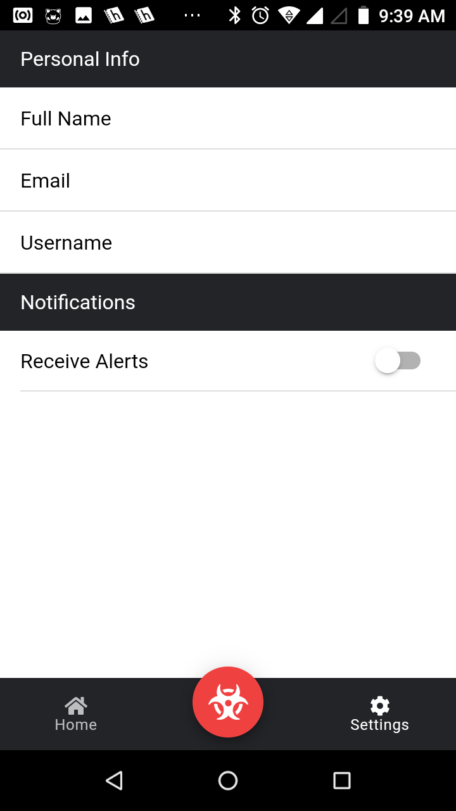

# Crime Tracker App
[](https://ionicframework.com) [](https://reactjs.org) [](https://mapbox.com)
> App created to track(and ideally reduce) crime areound the world.

## Screenshots
  

## How to run

1. Clone the project

```bash
git clone https://github.com/jessekelly881/Crime-Tracker-App
cd Crime-Tracker-App
```

2. Install dependencies

```bash
npm install
```

3. Run production server

```bash
ionic serve
```

4. Point browser to http://localhost:4000


## Contributing

### Code style

This app makes heavy use of react hooks and functions. **Code that introduces large dependencies or makes use of class based components will not be accepted!**

### How to contribute

If you wish to contribute please contact me at kellyjesse881@gmail.com or create a push request. I will try to review as quickly as possible.
